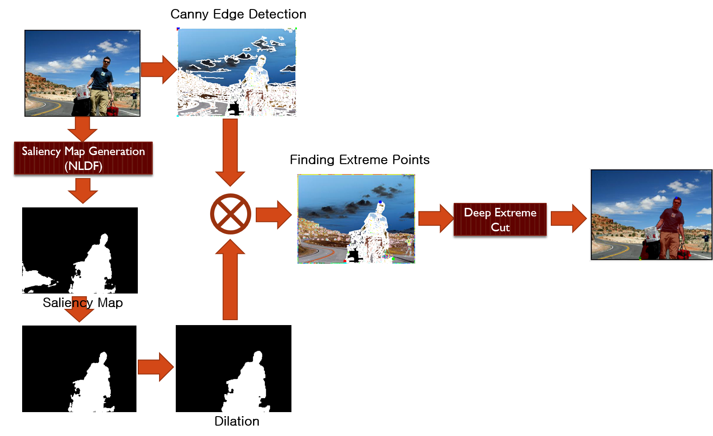

# Automatic Deep Extreme Cut



## Prerequisites

- [Python 3](https://www.continuum.io/downloads)
- [Pytorch 0.3.6](http://pytorch.org/)
- [torchvision](http://pytorch.org/)
- [visdom](https://github.com/facebookresearch/visdom) (optional for visualization)

### Installation
The code was tested with Anaconda and Python 3.6. After installing the Anaconda environment:

0. Clone the repo:
    ```Shell
    git clone https://github.com/kh22l22/Auto-DEXTR-Pytorch
    cd Auto-DEXTR-Pytorch
    ```
 
1. Install dependencies:
    ```Shell
    conda install pytorch torchvision -c pytorch
    conda install matplotlib opencv pillow scikit-learn scikit-image
    ```
2. Run demo code
    ```Shell
    python demo.py
    ```
3. default choose: download and copy the [pretrained model](https://drive.google.com/file/d/10cnWpqABT6MRdTO0p17hcHornMs6ggQL/view?usp=sharing) to `weights` directory.

## Related Projects:
[NLFD](https://github.com/AceCoooool/NLFD-pytorch): Luo Z, Mishra A, Achkar A, Eichel J, Li S-Z, Jodoin P-M, “Non-Local Deep Features for Salient Object Detection”, IEEE Conference on Computer Vision and Pattern Recognition (CVPR 2017)

[Deep Extreme Cut](): K.K. Maninis*, S. Caelles*, J. Pont-Tuset, and L. Van Gool 
Deep Extreme Cut: From Extreme Points to Object Segmentation,
Computer Vision and Pattern Recognition (CVPR), 2018.

## Acknowledgments
Code borrows from [NLFD](https://github.com/AceCoooool/NLFD-pytorch) and [Deep Extreme Cut](https://github.com/scaelles/DEXTR-PyTorch). 
